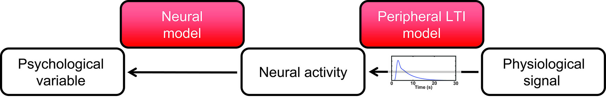
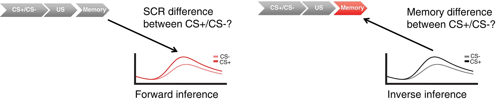

# Psychophysiological Modelling with PsPM: precision psychophysiology made easy

**Current version: PsPM 7.0.0, released on 12.02.2025**

Psychophysiological data (e.g. SCR, pupil size, heart rhythm) are routinely used to quantify psychological states or latent variables (e.g. arousal, attention, decision uncertainty, or fear and reward memory). PsPM uses statistical models of the mind-body relationship in order to make this inference transparent. With an integrated and automated work flow from raw data import to export of participant-level (condition-level or trial-by-trial) summary statistics, PsPM combines analytical reproducibility with plug-and-play implementation.

Indeed, inverse inference is arguably the most common application of psychophysiology: estimating a psychological, cognitive or neural state, given peripheral data. In these cases, the interest is not in the physiology itself - the interest is in the psychological process. Psychophysiological Modelling offers a statistically rigorous approach to this problem, which is implemented in PsPM.

To describe the relation between psychological variables and the observed signal, and to estimate the psychological input that generated the observed signal, PsPM implements convolution models. These models have been developed on large and independent data set.

PsPM implements models for skin conductance, pupil size, gaze patterns, heart beats, respiratory signals, and startle eyeblink EMG. PsPM supports many data formats, including CED Spike, Biopac AcqKnowledge, VarioPort, (exported) ADInstruments LabChart, (exported) Biograph Infiniti, (exported) MindMedia BioTrace, Dataq/Windaq, ScanPhysLog, EDF, (asc-exported) Eyelink, Matlab, and Text files.

Further features are simple programming of add-ons for import and modelling of new data types, and automatic creation of batch scripts via the GUI.

To install the toolbox, go to [download](https://bachlab.github.io/PsPM/download/).

Our [online course](https://bachlab.github.io/PsPM/learn/) provides in-depth information about the software and about the implemented methods, whether you are a newcomer to psychophysiological modelling or an experienced user who wants more detail.

For help, see the [Discussion forum on github](https://github.com/bachlab/PsPM/discussions).

PsPM is provided under the GNU General Public License by the PsPM team, hosted at [the Centre for Artificial Intelligence and Neuroscience, University of Bonn](https://www.caian.uni-bonn.de/en/home)

